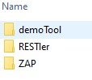

# On-boarding your own tools
RAFT allows you to on-board any tool that is packaged into a docker container.
This means that any public (or private tool you develop) is available 
to include in the test suite you design to test your services.

**At this time only Linux containers are supported.**

## Tool Configuration

Tools are packaged in containers. These containers are then deployed into a [container instance](https://azure.microsoft.com/en-us/services/container-instances/). 
[See subscription default quota's and limits](https://docs.microsoft.com/en-us/azure/container-instances/container-instances-quotas#service-quotas-and-limits)
to understand your scaling limits.

See [Container Instance Pricing](https://azure.microsoft.com/en-us/pricing/details/container-instances/) to understand the cost
implications of running your tool.

### 1. Create the folder
Your first step in integrating a tool is to create a folder under cli/raft-utils/tools.
Give your tool a name, this is the name that you will use in the jobDefinition "toolName" field.
The name is case sensitive.

Let's assume we have a tool called demoTool. Create the folder.</br>


### 2. Create config.json

The config.json file defines the commands that will run your tool. It also defines
the resources needed by the container. 

```
{
	"container" : "demoTool/demoTool-stable",

	"run" : {
		"command" : "bash", 
		"arguments" : ["-c", 
		    "cd $RAFT_RUN_DIRECTORY; ln -s $RAFT_WORK_DIRECTORY /demoTool; python3 run.py install; python3 run.py" ]
	},
	"idle" : {
		"command" : "bash",
		"arguments" : ["-c", "echo DebugMode; while true; do sleep 100000; done;"]
	}
}
```

In this example, the "container" field defines the docker image. By default dockerhub is
searched for the image.

#### Private Registries
If you want to specify an image from a private repository, create a secret that starts with the
string `PrivateRegistry` in the key vault.
This secret will be a json blob consisting of repository name, user name, and password. 
For example:

```
	{
		"repository" : "myprivateRegistry.azurecr.io",
		"user" : "myUsername",
		"password" : "myPassword"
	}
```

When the orchestrator starts, it will search the key vault for secrets that begin with `PrivateRegistry` and register
each one so it is available for use. 

These key vault entries will be registered in alphabetical order of the secrets.
Registries will be searched for the requested image in the same order, starting with the public docker registry, and
then moving though the private registries.

#### Container resources
The "containerConfig" section defines the set of resources that will be allocated to the container.
"CPUs", "MemorySizeInGB", and "GPUs" can be defined. 

#### Commands

The `run` and `idle` commands are used in two different job launch scenarios. `run` is used to actually run
a job, and `idle` is used when you want to interactively work with the container. 

The "command" needs to be a command that is available on the container. In the "arguments" you can reference
environment variables that have  been preset for you.

The environment variables are:
* RAFT_JOB_ID</br>
  This is the id of the currently executing job. If you generate events, this will be needed.
* RAFT_CONTAINER_GROUP_NAME
* RAFT_CONTAINER_NAME
* RAFT_APP_INSIGHTS_KEY</br>
  Use the app insights key if you want to log to the app insights instance created with the service.
* RAFT_WORK_DIRECTORY</br>
  In the work directory you will find a `task-config.json` that contains any data defined in the
job definition `toolConfiguration` section of the task. The format of this data is under your control.
For example, a RESTler job definition might contain the following toolConfiguration

  ```
  "toolConfiguration" : {
        "task": "TestFuzzLean",
        "agentConfiguration": {
          "resultsAnalyzerReportTimeSpanInterval": "00:01:00"
        },
        "runConfiguration": {
          "previousStepOutputFolderPath": "/job-compile/0",
          "useSsl": true,
          "producerTimingDelay": 5
        }
      }
  ```
  This data fragment would be available in the task-config.json file. 

* RAFT_RUN_DIRECTORY</br>
  When the tool is uploaded to the file share via the cli command `python raft.py service upload-utils`
a unique file share is created and mounted to the container as read-only. This gives you an easy way to reference any scripts 
or executables you launch.
* RAFT_RUN_CMD</br>
  The command that was run when the container was launched.

### 3. Swagger schema for your tool (optional)

If you specify a swagger document called schema.json in your tool folder, it will be folded in under the toolConfiguration
node in the service swagger. All component types referenced in the swagger must be defined in the file.
See the RESTler tool schema.json file as an example.