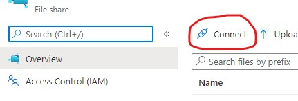

# FAQ

**I see 404's for GET /robots933456.txt in my Application Insights log**
 We deploy containers to the webapp. See this [explanation](https://docs.microsoft.com/en-us/azure/app-service/containers/configure-custom-container#robots933456-in-logs).

**Why use file shares?**
 File shares can be mounted to the containers running tools. This provides an easy way to share data.

The use of file shares makes it easy to upload your custom swagger files and also passing data between different jobs. For example RESTler requires an initial compile step that is consumed by the Test and Fuzz steps. The output of the compilation step can be mounted to multiple containers. Each of these containers (tasks) may be configured differently to get different behavior from the tool. You can also view real time log changes and results in the files share during the job run, 
and mount these file shares to your computer for a better user experience. 

To mount the file share, use the connect button on the azure portal.

**How do I turn off telemetry?**
 The REST API Fuzz Testing service sends anonymous usage data for the purpose of improving the
service. To turn this off, see "Step 3: Choose Configuration Options" in [How To Deploy](how-to-deploy.md)
