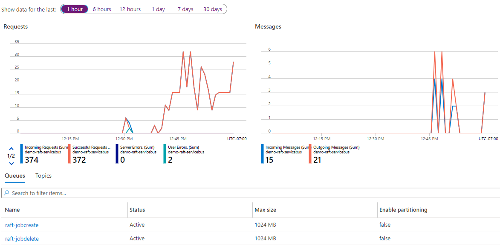
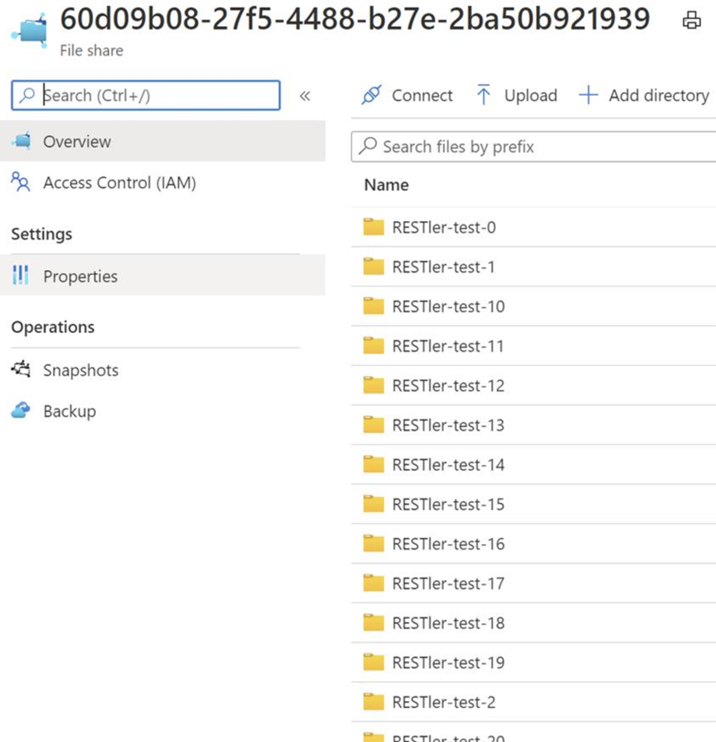
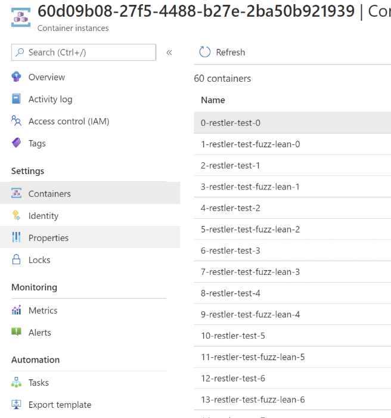
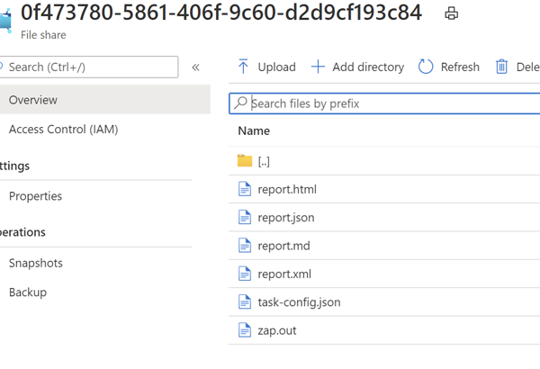
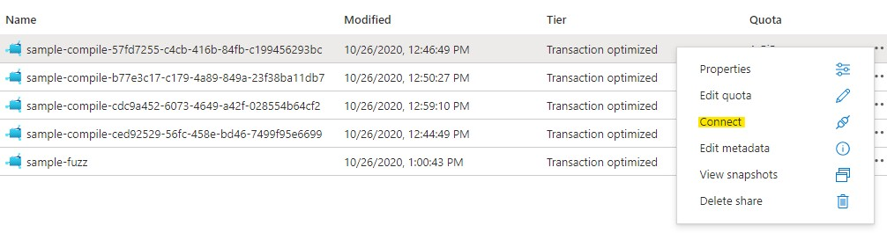

# RAFT: How It Works

This page describes the architecture and operation of the REST API Fuzz
Testing (RAFT) service.

At a high level, a number of Azure resources are created by the RAFT
installer, and security tools (that run in containers) are deployed and
run in Azure against their configured targets.

All the details about those resources and how data is sent to and retrieved from the
tool containers is described below.

 

## Azure Resource Structure

RAFT runs on [Azure](https://azure.microsoft.com/en-us/); all you
need to get started is an Azure [subscription](https://azure.microsoft.com/en-us/free/).

The [deployment](how-to-deploy.md) script will create all the resources that you need
for the RAFT service to run.  You can use the [Azure portal](https://portal.azure.com)
to view these resources, monitor their usage and cost, and if necessary, troubleshoot
problems.

The resources that are used by the service are:

| Azure Resource | How RAFT uses it | 
|----------------|------------------|
| [App Service](https://azure.microsoft.com/en-us/services/app-service/) | Provides the front-end REST API to which our CLI and other client apps connect |
| [App Service Plan](https://docs.microsoft.com/en-us/azure/app-service/overview-hosting-plans) | VMs used for App Service and Azure functions |
| [Event Grid Domain](https://docs.microsoft.com/en-us/azure/event-grid/event-domains) | Enables webhook configuration and execution |
| [Key Vault](https://docs.microsoft.com/en-us/azure/key-vault/) | Hosts service and user secrets to ensure controlled access to containers and results |
| [Azure Functions](https://docs.microsoft.com/en-us/azure/azure-functions/) | Provides the platform for service orchestration |
| [Service Bus](https://docs.microsoft.com/en-us/azure/service-bus-messaging/service-bus-messaging-overview) | Queues and delivers messages between service components |
| [Storage Accounts](https://docs.microsoft.com/en-us/azure/storage/common/storage-account-overview) | Provides secure storage for the service and container execution and results |
| [Application Insights](https://docs.microsoft.com/en-us/azure/azure-monitor/app/app-insights-overview) | Optional feature for collecting and analyzing large sets of output logs |

 

#### Estimated Azure Costs

Here's a breakdown of the estimated Azure spend for running RAFT:

**Fixed Costs**
- Web app - This depends on the SKU selected (For example: B1 is ~$12/month, P1V1 ~$70/month)
- Event Grid - Free (100,000 messages free/month)
- Service Bus  (Standard) - $10/month

**Variable Costs**
- Application Insights - Pay-As-You-Go is $2.30/GB (5GB/month included free)
- Storage Account - $0.58/GB per month
- Container Instances - about $0.045 cents per running hour.  (A container instance
  is created for each submitted job and runs for the specified duration in the job definition.)

 

## How a job executes

A job execution proceeds across nine steps as follows:

 

#### Step 1: Job Definition Submitted

Job configurations are submitted via a JSON blob to the RAFT service front-end via the
CLI or other client app (e.g., Postman or some code you've written calling the REST API).

Note that upon running `job create` or calling `POST /jobs/v1` with the job
definition JSON, you're handed back a Job ID; you'll need this to identify
the specific Azure resources created for this job.

Further note that this step causes the `jobStatus` webhook to fire.

#### Step 2: Job Queued to Service Bus

Submitting the job and its JSON description causes a message to be queued onto the
service bus, where it is picked up and processed by the back-end orchestrator.

To observe how this works in Azure, browse to your deployment's resource group and
view the Service Bus named **[Deployment]-raft-[secondSubscriptionOctet]-servicebus**.  Note that any particular
message may only reside on the queue for a short time, but you're able to see the
cumulative counts of incoming and outgoing messages, along with counts of server and
user errors, and trending over time.

#### Step 3: Job File Share Created

Once the orchestrator grabs the job-specific message of the queue, it start the process
of creating and configuring the necessary Azure objects to execute it.  The first object
is a file share -- there is one created per job, and each task in the job has a designated
folder that it will use.

To see this in Azure, browse to your deployment's resource group and view the Storage
Account named **[Deployment][secondSubscriptionOctet]raftrslt** to see all your deployment's
file shares, and then browse to the one named for the Job ID (that was given to you 
by the CLI or API call when you created it).  Open that up to see each task folder.

#### Step 4: Container Group and Containers Created

The orchestrator then creates a container group for the job, named using the Job ID,
and one container per task in the job, named for the task's output folder.

To see this in Azure, browse to your deployment's resource group; all container groups
(with GUID-like names) exists at the same level as the deployment-level resources.

> [!NOTE]
> Note that [Azure Docs](https://docs.microsoft.com/en-us/azure/container-instances/container-instances-overview)
> refers to a collection of serverless containers as an "Azure Container Instances".
> We are instead using the term "container group" for clarity.

#### Step 5: The File Share is Mounted On Each Container

The file share from Step 3 is mounted on the container created in Step 4.
The task-specific folder under this common file share is set as the working
folder on each corresponding container, meaning that the task-specific output
from each container ends up in its corresponding task-specific subfolder.

The orchestrator then writes the **task-config.json** file to each working
folder that is subsequently read in by the tool that executes for that task.

#### Step 6: Tools in Containers Are Executed

After the file share is mounted on each container, the orchestrator then
runs each container's payload using the parameters you provided in the job
definition JSON file.

In this screen shot, we've clicked on a task-specific subfolder (where the
task is to run the ZAP web scanner) to see its contents:

Note that the **task-config.json** file is the first to be placed in the folder
once it's designated as the working directory for the container.

Also note that this step causes the `jobStatus` webhook to fire.

#### Step 7: Tool Output Is Processed

When an agent processes the task output, it may send job progress events to the Service
Bus. These events are recorded in the job status azure table by job ID. 
Status can be retrieved with the CLI or with a REST API call to the RAFT service.

#### Step 8: Each Container Completes Or Is Halted

A task either runs to completion itself or can be configured to be halted via the
`duration` parameter.  Alternatively, you may halt execution via the Azure portal.
In any case, once the execution completes, the orchestrator marks that task as complete.
Once all tasks are complete, the orchestrator marks that job as complete.  If any of
the tasks fail, the orchestrator will allow all tasks to complete, but the job will
be marked as failed.

#### Step 9: Job Completes

On job completion, the orchestrator will mark the container group for deletion,
but leaves all created files untouched.

Also note that this step causes the `jobStatus` webhook to fire.

 

## Job Output

The output of each tool can be collected in real time from the Azure storage account
configured to receive it.

Note that each tool will have its own output structure; ZAP varies from RESTler, for
example.

You have the ability to launch commands that connect to these output sources and
generate job status or webhook data. See the ZAP `scan.py` script as an example. 

#### Options to Browse Output

You have a number of options for viewing, retrieving, and deleting this data.

- First, you can install [Azure Storage Explorer](https://azure.microsoft.com/en-us/features/storage-explorer/),
  a free utility that allows easy browsing of all the object types in a storage
  account
  
- From Azure portal, use the connect context menu to get the commands to mount the folder
directly onto your machine. The context menu provides mounting directions for Windows, MacOS, and Linux 
operating systems. 

Note for this work your ISP must not block port 445. See the instructions on the connect menu
to find out which ISP's block this port.

- Finally, you can use the azure portal to browse the contents of the file share on your storage account.

