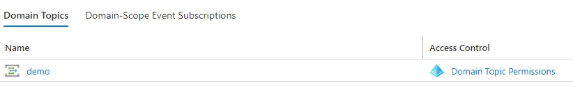
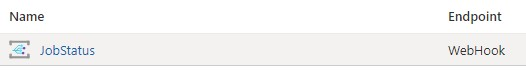

# How to Configure Webhooks

Webhooks in RAFT are specially crafted  HTTP POST requests, with a JSON payload,
that are issued in response to an event in a RAFT service instance. They are typically
received by an endpoint such as [Microsoft Logic Apps](https://azure.microsoft.com/en-us/services/logic-apps/)
 that in turn handles the event, which might take the form of sending an email, writing
to a collaboration channel like Teams or Slack, or auto-filing a bug.

Webhooks in RAFT are implemented as an
[Azure Event Grid Domain](https://docs.microsoft.com/en-us/azure/event-grid/event-domains). 

<br/>

## Viewing the Event Grid Domain

Looking at the resources created when you deploy the RAFT service you will see
the Event Grid Domain with the name **[Deployment]-raft-events**.

Looking at the Event Grid Domain you will see a list of "Domain Topics" at the bottom of the overview tab.



In this example the webhook name is "demo"

When you click on the domain name, you will see the events that have been defined for it.



Each event under the domain topic (JobStatus in our example above) can have it's own target 
URL which is called when the event is fired. The events which are currently supported are:

* JobStatus
* BugFound

The webhook receiver must implement the [Endpoint validation protocol](https://docs.microsoft.com/en-us/azure/event-grid/webhook-event-delivery).
This allows the event grid to ensure that the target URL is a valid 
endpoint when it is established. Azure logic apps or Office 365
[Power Automate](https://flow.microsoft.com/) implement this protocol for you.

<br/>

## How to Create a Webhook

To create a webhook in the CLI use the `webhook create` command.

` python raft.py webhook create --name <webhookName> --event [JobStatus | BugFound] 
--url "<url, be sure it's quoted>"`


<br/>

## How to Test a Webhook

Once you have created a webhook, you might like to test it in order to verify your receiver is working correctly.

To test a webhook in the CLI use the `webhook test` command.

` python raft.py webhook test --name <webhookName> --event [JobStatus | BugFound]`

Dummy event data will be sent to the webhook so that you can see that your webhook receiver is working.

Here is an example of dummy JobStatus data:

```
[
  {
    "Id": "22852157-30a4-4a8c-ace7-307d9e5a29e0",
    "EventType": "JobStatus",
    "Subject": "JobStatus",
    "Data": {
      "Tool": "",
      "JobId": "a3405ee2-d451-4dc0-b82a-14da2cafc715",
      "State": "Completed",
      "UtcEventTime": "2020-10-29T20:48:00.8691276Z",
      "Details": {
        "CpuAverage": "11.166667",
        "NetworkTotalBytesReceived": "946815",
        "NetworkTotalBytesSent": "918968"
      },
      "Metadata": {
        "branch": "wizbangFeature"
      },
      "AgentName": "a3405ee2-d451-4dc0-b82a-14da2cafc715"
    },
    "DataVersion": "1.0",
    "metadataVersion": "1",
    "EventTime": "2020-10-29T20:48:00.9246989Z",
    "Topic": "/subscriptions/1bec681b-d2cb-4fde-afe3-09bf923d6248/resourceGroups/stas33-raft/providers/Microsoft.EventGrid/domains/demo-raft-events/topics/LogicApp"
  }
]
```

In this data structure the `Data` portion of the structure is unique to the RAFT service. The other information is standardized from the Event Grid.

<br/>

## How to Incorporate Webhooks in a RAFT Job

In order to cause webhooks to fire when a job is running, you will need to include a webhook section
in your job definition.

```json
  "webhook": {
    "name": "sample-webhook-name",
    "metadata": {"branch" : "wizbangFeature", "author" : "joe"}
  }
```

The `name` field is the same name you used when creating the webhook above. The `metadata` field
is optional. It is a dictionary of key/value pairs that will be returned in every webhook message.
This can be useful to pipeline specific information with webhook data.
<br/>

## How to Delete a Webhook

To delete a webhook in the CLI use the `webhook delete` command.

```python
$ python raft.py webhook delete --name <webhookName> --event [JobStatus | BugFound]`
```

It's required to provide the webhookName and the event you wish to delete. There is
not a way to delete the webhook name without specifying the event. Once the last event
has been deleted the domain topic is removed.
