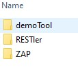

# How to Onboard a Tool, Step by Step

REST API Fuzz Testing (RAFT) is a platform designed to automate the execution
of security tools against REST APIs, typically from a CI/CD platform.  But it
in theory can run any tool you'd like, subject to some conditions, and in this
doc we'll walk you through the process of onboarding a new tools to the platform.

<br/>

## Step One: Prep the Tool Container

RAFT allows you to onboard any tool that is packaged into a docker container.
This means that any public tool (or private tool you develop) is available to
include in the test suite you design to test your services.

> [!NOTE]
> At this time only Linux containers are supported.

Tools are packaged in containers. These containers are then deployed into a
[container instance](https://azure.microsoft.com/en-us/services/container-instances/)
in Microsoft Azure.   How many tools you may run simultaneously and the cost of doing
so is determined by your subscription's
[quotas and limits](https://docs.microsoft.com/en-us/azure/container-instances/container-instances-quotas#service-quotas-and-limits).

#### Installing a command-line tool in a container

TODO: point to instructions on docker.com,

TODO-clarify: The only output method that RAFT currently provides to extract data is through a
mounted file share.  That said, you may export data from the docker container
(e.g., write to a DB, call and API, etc.) in any way you choose -- we do not
block this.

You may want to consider writing an **agent**, or a daemon if you prefer, that 
starts up and provides continual monitoring of the security tool you're running;

- negotiating authentication to the target
- sending messages to the Deployment's Service Hub to:
  - Emit a progress indicator (percent covered, items found, etc.)
  - Register a bug found (which would in turn trigger a web hook)
- and tool-specific output processing or serialization needed
 
For example, see the **raft\cli\raft-utils\tools\ZAP\run.py** python file.  This is 
an agent we wrote to get ZAP to run inside RAFT.  The `report_status` function,
for example, notifies the service bus of ZAP event of note.

Note that the agent can only send outbound messages; we do not support inbound 
connections to the agent at this time.

#### Making the container available to RAFT

The container that you want to add must either be present in [Docker Hub](https://hub.docker.com/)
or in a private repository; RAFT will automatically download it to the machine from
which you're executing RAFT if it is missing or your local copy is outdated.

To enable RAFT to retrieve a container from a private repository, you'll need
to create a secret in your Deployment's key vault, which is named
**[Deployment]-raft-kv[thirdSubscriptionOctet]**.  The secret name must start
with the string `PrivateRegistry` and its value must be a JSON blob consisting
of the repository name, the user name, and the password as follows: 

```json
{
  "repository" : "myprivateRegistry.azurecr.io",
  "user" : "myUsername",
  "password" : "myPassword"
}
```

Hold onto this, you'll need it in JSON blob in Step Three.

<br/>

## Step Two: Create the Tool Folder

Your first step is to create a folder in the **cli/raft-utils/tools** folder under
the RAFT repo.  The name of the folder should be same name you will use in the
tool's `toolName` field in the Job Definition JSON blob you construct to execute
the tool.  Note that tool names are case sensitive.

Let's assume we have a tool called **demoTool**. Create the folder as such alongside
the existing tools:



<br/>

## Step Three: Create Tool Config.json

RAFT expects each tool it launches to have a designated **config.json** file inside
the tool folder created in Step Two that maps the RAFT orchestration steps to the
corresponding commands your tool expects, and defines the resources that the tool's
container needs to run.

Here's a simple example: 

```json
{
  "container" : "demoTool/demoTool-stable",
  "run" : {
    "command" : "bash", 
    "arguments" : ["-c", 
      "cd $RAFT_RUN_DIRECTORY; ln -s $RAFT_WORK_DIRECTORY /demoTool; python3 run.py install; python3 run.py" ]
  },
  "idle" : {
    "command" : "bash",
    "arguments" : ["-c", "echo DebugMode; while true; do sleep 100000; done;"]
  }
}
```

We'll discuss each of the configuration sections in the next steps.

</br>

## Step Four: Designate Container

In this example, the `container` field defines the docker image. As explained
in Step One, RAFT will download this container if it is not present or outdated locally.

For private Docker registries, when the orchestrator starts it will search the key vault
for secrets that begin with `PrivateRegistry` and register them in alphabetical order
so that each is available for use.  Registries will be searched for the requested image
in the same order, starting with the private registries and then iterating through the
public Docker Hub.

</br>

## Step Five: Define Run and Idle Sections

The `run` and `idle` sections define how RAFT will execute a security tool under normal
use and for debugging tool runs, respectively.  When tool execution completes in the former
scenario, the parent container is marked for deletion and recycles; in the latter scenario,
the container is not deleted and must be removed manually, providing operators the ability
to connect to it to investigate issues.

Each section requires a `command` and an `arguments` parameter.  `command` is the relative
or absolute path to an executable image on the container image that will be run.  The 
`arguments` string is passed to STDIN as the command line argument string.

Whether the `run` or `idle` sections are executed upon the `create job` command is
determined by the `isIdle` setting in the submitted job description JSON blob.  If the
`update job` command is executed, for example while you're SSH'd to the container for
debugging purposes, the `run` command is executed.

#### Referencing Environment Variables

The `arguments` parameter may reference the following environment variables that have
been populated for you by the orchestration:

| Environment Variable | Value |
|----------|------------------------|
| RAFT_JOB_ID | The Job ID string of the currently executing job; you'll need this if you plan to generate events |
| RAFT_CONTAINER_GROUP_NAME | The name of the parent's container's Container Group |
| RAFT_CONTAINER_NAME | The name of the parent's container |
| RAFT_APP_INSIGHTS_KEY | The key needed to identify this container in messages logged to Application Insights |
| RAFT_WORK_DIRECTORY | The absolute path to the file share mounted to the container (contains the **task-config.json** file) |
| RAFT_RUN_DIRECTORY | The absolute path to the tool folder created in Step Two that gets mounted as read-only to the container as well* |
| RAFT_RUN_CMD | The command text provided in the `command` parameter |

*This folder TODO-Stas: When the tool is uploaded to the file share via the cli command `python raft.py service upload-utils` a unique file share is created and mounted to the container as read-only. This gives you an easy way to reference any scripts or executables you launch

#### Referencing the task-config.json file

In the mounted folder whose path is indicated in the RAFT_WORK_DIRECTORY you will find
the **task-config.json** file that contains any data defined in the job definition
`toolConfiguration` section of the task. The format of this data is under your control.
For example, a RESTler job definition might contain the following `toolConfiguration` blob:

 ```json
"toolConfiguration" : {
  "task": "TestFuzzLean",
  "agentConfiguration": {
    "resultsAnalyzerReportTimeSpanInterval": "00:01:00"
  },
  "runConfiguration": {
    "previousStepOutputFolderPath": "/job-compile/0",
    "useSsl": true,
    "producerTimingDelay": 5
  }
}
```
 
This data might be useful to a custom agent, for example, to execute more complex
transforms or call custom APIs.

<br/>

## Step Six: Optionally Deploy Your Tool's Swagger Doc

If you specify a swagger document called **schema.json** in your tool folder, it will
be merged with the `toolConfiguration` node in the service swagger. All component
types referenced in the swagger must be defined in the file.

See the RESTler tool **schema.json** file, located at cli/raft_utils/tools/RESTler
as an example.

<br/>

## Step Seven: Refresh your Toolset

After you've saved the updated **config.json** file, you'll need to push the new or updated
tool definition to your RAFT deployment.  You can do this via the following command:

```javascript
D:\REPO\raft\cli>py raft.py service upload-utils
```

This also has the effect of restarting the local service.