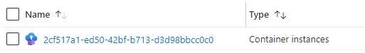
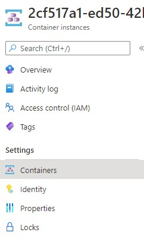
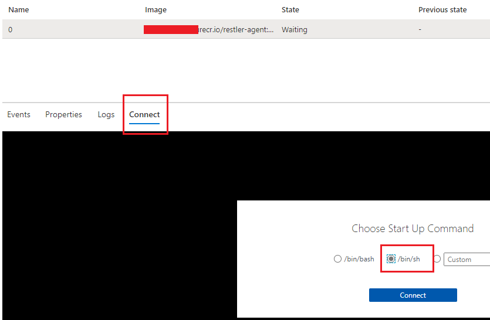
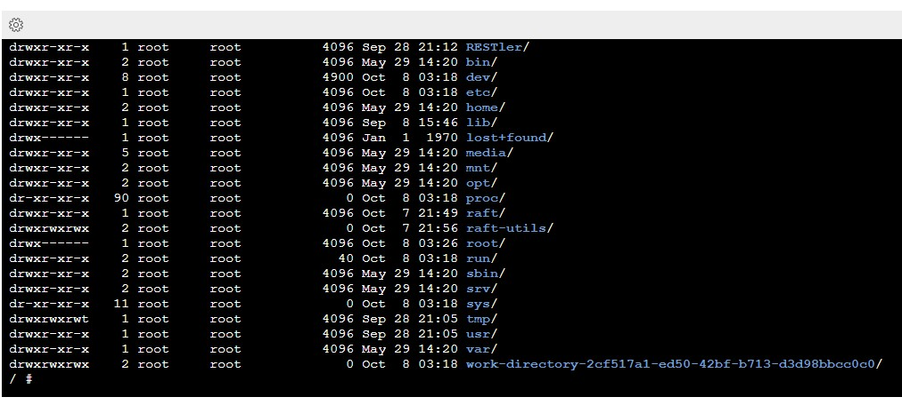

# How To Submit A Job, Step by Step

This page describes how to prepare, submit, observe, and get results from a
REST API Fuzz Testing (RAFT) job.

A RAFT **job** is the execution of one or more security tools against one or
more targets.  While most tools can be run and RAFT, and most targets can be
targeted, the service is designed to test REST APIs, typically from within a
CI/CD pipeline.  Jobs run in container groups, and execute either till the tool
completes or until the configurable duration has expired.

The following tutorial walks through the exact process needed to submit a job.
This assumes that you've correctly [deployed](how-to-deploy.md) the RAFT service
to an Azure subscription.

<br/>

## Step One: Pick the Tool and Target

RAFT was built to streamline the execution of security tools against web sites and services.
So it makes sense, then, to use RAFT, you need to 

RAFT comes with two registered tools:

- [RESTler](https://github.com/microsoft/restler-fuzzer), a stateful REST API fuzzer from [NSV at Microsoft Research](https://www.microsoft.com/en-us/research/group/new-security-ventures/)
- [ZAP](https://www.zaproxy.org/), a web scanner from the [OWASP Foundation](https://owasp.org/)

To register additional tools, please see please see the
[Onboarding a Tool](how-to-onboard-a-tool.md) page.

<br/>

## Step Two: Choose the Job Configuration Options

The **job definition** is the set of all configuration options that fully defines
how a job runs.   Initially, you'll create the job definition as a JSON file on your
local computer; the RAFT CLI will then submit its content as the body of the REST API
call to the `POST /jobs` endpoint that creates a new job in your RAFT service instance.

But before you can create this file, you'll need to choose which of the configuration
options are relevant to you, and values you'll configure for the options you've chosen.

We'll provide a quick summary here, but you should take the time to browse the
[job definition](schema/jobdefinition.md) schema to see the full set of options.

At a high level, a valid job definition must include the following:

- From one to 60 tasks; a **task** is the execution of a single docker container
- Either a global swagger file or swagger files for each tool that requires one
- Either a global host definition or a host for each tool that requires one
- Either a global duration or a duration for each tool that requires one
- Either a global output folder or a duration for each tool that requires one (? TODO)
- Any other required runtime settings for each tool

#### Is your web site authenticated?

It very probable that the REST API or web site you want to test with RAST will
require some sort of authentication.  

TODO: what are the authentication options?

        "authenticationMethod": {
          "MSAL": "RaftServicePrincipal"
        }
<br/>

## Step Three: Create a Job Definition File

Now that you've settled on the options you'll set and their respective values, it's time
to create the job definition JSON file you'll use to submit the job and put RAFT to work.

All Job Definition JSON files are required to define the `tasks` section.
The `swaggerLocation`, `host`, and `duration` fields can be defined globally
or locally, depending on whether you want these values to apply to all tasks or
to individual tasks.

Following is an example of a simple job definition file that provides a global
swagger location and host settings, along with two tasks:

```json
{
  "swaggerLocation": {
    "URL" : "https://{sample.host}/swagger/v1/swagger.json"
  },
  "host": "{sample.host}",
  "tasks": [
    {
      "toolName": "MyFirstTool",
      "outputFolder" : "my-tool-output-folder"
    },
    {
      "toolName": "MySecondTool",
      "duration": "02:10:00",
      "outputFolder" : "my-tool-output-folder"
    }
  ]
}
```

If this job definition file were submitted to RAFT, it would cause the following to
occur:  TODO:correctness

- A container named "MyFirstTool" would fire up, taking the `swaggerLocation` and `host`
  parameters from the global position, and `toolName` and `outputFolder` parameters
  from the task definition.  Since there is no `duration` field, it will run until it
  completes

- A container named "MySecondTool" would fire up, taking the `swaggerLocation` and `host`
  parameters from the global position, and `toolName`, `duration`, and `outputFolder`
  parameters from the task definition.  It will run until it completes, or until 2 hours 
  ten mintues have passed, whichever occurs first

Note that tasks are launched in parallel, and that the overall job is considered complete
once each task completes.

For more information...

- ... on how a job executes, please see the [How It Works](how-it-works.md) page
- ... how to adjust how each tool runs in its container, please see the [Onboarding a Tool](how-to-onboard-a-tool.md) page
- ... on a variety of different ways to use RAFT, please see our [Samples](samples.md) page for a variety of job definion files

<br/>

#### Debug Execution Mode

By default, a given job proceeds as we've described: a container launches for each
defined task with the appropriate parameters, and run until the contained tool exits
or the duration expires.

Sometimes you'll want to have more control over the container execution, for debugging
a faulty job or observing the execution of a [new tool](how-to-onboard-a-tool.md), for
example.

If you set the `isIdling` job parameter to true, then the following occurs instead:

	1. container will launch
	2. container will execute "idle" command defined in config.json for the tool 
	3. optionally, you may execute raft update to launch tasks in that container
	4. At some point, you must manually delete the container

```json
"idle" : {
  "command" : "bash",
  "arguments" : ["-c", "echo DebugMode; while true; do sleep 100000; done;"]
}
```

This bears repeating:  if `isIdling` is set to true, the container is not deleted after
its task completes.

<br/>

## Step Four:  Submit the job

Fire up the [RAFT CLI](cli-reference.md) and ensure it's configured to point to a valid service instance.

```python
$ py raft.py job create --file PATH_TO_JOB_DEFINITION_FILE
```

<br/>

## Step Five: Monitor the Job

To test out new tools, or to troubleshoot existing tools, you may want to connect
to the containers where the tools are running to view logs, execute commands, check
environment variables, and so on.  To do so, you'll need to SSH to the container via
the Azure portal.

As we discussed above, it's recommended that you configure a given job in Debug mode,
so that the container is not deleted upon tool error or completion.

To configure this, find the tool's `config.json` file in the `cli/raft-tools/tools`
folder, and set the `isIdle` value to TRUE.  You also will want to set a command
to keep the container occupied. TODO

For example, the following would start /bin/sh and wait.

```json
"idle" : {
  "command" : "/bin/sh",
  "arguments" : ["-c", "echo DebugMode; while true; do sleep 100000; done;"]
}
```

Using the [azure portal](https://azure.portal.com) navigate to the resource group where
the service is deployed. Once a job is created you will be able to see the container
instance in the resource group. The name of the resource is the same as the Job ID.

For example:



Here the value `2cf517a1-ed50-42bf-b713-d3d98bbcc0c0` is the Job ID.

Click on the container and select the **Containers** tab. 



Click on the connect tab and the shell you want to invoke on the container. In this example
/bin/sh is selected.



Once connected, use the /bin/sh commands to navigate the system:



Note that once a container is launched in `isIdle` mode, the container instance
will need to be deleted either with the CLI `delete` command, or through the portal. The
service will not automatically recycle these containers.