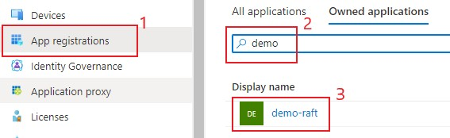
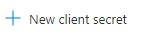
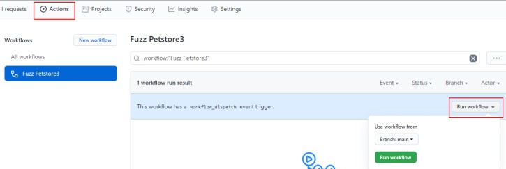

# How to fuzz using a github workflow

As a developer you want to incorporate continuous testing into your pipeline. 
Github workflows makes it easy to leverage RAFT to continually test your service API's during development.

Creating a github workflow is simple. The workflow can be triggered a number of ways including
on `push` requests, or manually as we are doing in this tutorial. 

This tutorial includes all the
files (except for the raft CLI files) you will need to create a working workflow which fuzzes
the [petstore3 example docker container](https://hub.docker.com/r/swaggerapi/petstore3).

To get started you will need to:
1. Deploy RAFT if you have not yet done so. </br>
See [How to deploy RAFT](how-to-deploy.md) 

2.  Copy the python sdk files into your repo. </br>
You will need the following python sdk files from the RAFT repo. Put these into your repo so they can
be referenced from the script invoked by the workflow. 
  - cli/raft.py
  - cli/requirements.txt
  - cli/raft_sdk/raft_common.py
  - cli/raft_sdk/raft-deploy.py
  - cli/raft_sdk/raft_service.py </br>

3.  Create a python script called `script/petstore3/run.py` using the code below.
This script will execute the logic to deploy to raft the job definitions that 
will fuzz the API.
In this example we are using RESTler to fuzz the container.</br>

```python
# Copyright (c) Microsoft Corporation.
# Licensed under the MIT License.
 
import pathlib
import sys
import os
import json
import argparse

cur_dir = os.path.dirname(os.path.abspath(__file__))
cli_dir = os.path.join(cur_dir, '..', '..', 'cli')
sys.path.append(cli_dir)
import raft
from raft_sdk.raft_service import RaftCLI, RaftJobConfig, RaftJobError, RaftDefinitions


def run(cli, config, subs):
    # Create job configuration object
    job_config = RaftJobConfig(file_path=config, substitutions=subs)
    print(f'Running {config}')

    # Submit a new job config and get new job ID
    job = cli.new_job(job_config)

    # Wait for a job with ID to finish the run
    cli.poll(job['jobId'])
    return job['jobId']

if __name__ == "__main__":
    try:
        defaults = None

        formatter = argparse.ArgumentDefaultsHelpFormatter
        parser = argparse.ArgumentParser(description='petstore3', formatter_class=formatter)
        raft.add_defaults_and_secret_args(parser)
        parser.add_argument('--buildId', required=True)
        args = parser.parse_args()

        if args.defaults_context_json:
            print(f"Loading defaults from command line: {args.defaults_context_json}")
            defaults = json.loads(args.defaults_context_json)
        else:
            with open(args.defaults_context_path, 'r') as defaults_json:
                defaults = json.load(defaults_json)

        print(f"BUILD ID : {args.buildId}")

        if args.secret:
            print(f"Secret given on command line")
            defaults['secret'] = args.secret

        # instantiate RAFT CLI
        cli = RaftCLI(defaults)
        defs = RaftDefinitions(defaults)

        compile_job_id = None
        # You can see how this substitution is used in the compile and fuzz json files
        subs = {
            "{ci-run}" : f"{args.buildId}",
        }

        compile_job_id = run(cli, os.path.join(cur_dir, 'compile.json'), subs)
        subs['{compile.jobId}'] = compile_job_id

        run(cli, os.path.join(cur_dir, "fuzz.json"), subs), 

    except RaftJobError as ex:
        print(f'ERROR: {ex.message}')
        sys.exit(1)
```

4. Create a `script/petstore3/compile.json` job definition file.
 ```JSON
{ 
  "rootFileShare" : "{ci-run}",
  "namePrefix" : "petstore3-compile-",

  "resources": {
    "Cores": 4,
    "MemoryGBs": 8
  },

  "testTargets" : {
    "resources" : {
      "Cores" : 2,
      "MemoryGBs" : 4
    },
    "services" : [
      {
        "Container" : "swaggerapi/petstore3",
        "Ports" : [8082],
        "ExpectedDurationUntilReady" : "00:00:30",
        "Shell" : "/bin/sh",
        "Run" : {
          "ShellArguments" : ["-c", "java -jar /swagger-petstore/jetty-runner.jar --log /var/log/yyyy_mm_dd-requests.log --port 8082 /swagger-petstore/server.war"]
        },
        "PostRun" : {
          "ShellArguments" : ["-c", "cp /var/log/*-requests.log $RAFT_WORK_DIRECTORY"],
          "ExpectedRunDuration" : "00:00:10"
        },
        "OutputFolder" : "petstore3"
        }
    ]
  },
  "testTasks" : {
    "targetConfiguration" : {
      "apiSpecifications": ["http://localhost:8082/api/v3/openapi.json"],
      "endpoint" : "http://localhost:8082"
    },
    "tasks": [
      {
        "toolName": "RESTler",
        "outputFolder": "compile",
        "toolConfiguration": {
          "task": "Compile"
        }
      },
      {
        "toolName": "Dredd",
        "outputFolder": "dredd"
      }
    ]
  }
}
```

 5. Create a `script/petstore3/fuzz.json` job definition file.
```JSON
{
  "rootFileShare" : "{ci-run}",
  "namePrefix" : "petstore3-test-fuzz-lean-",

  "resources": {
    "Cores": 4,
    "MemoryGBs": 8
  },

  "webhook":{
    "name" : "petstore3-fuzz",
    "metadata" : {
      "buildId" : "{ci-run}"
    }
  },

  "readonlyFileShareMounts": [
    {
      "FileShareName": "{ci-run}",
      "MountPath": "/ci-run"
    }
  ],

 "testTargets" : { 
    "resources" : {
      "Cores" : 2,
      "MemoryGBs" : 4
    },
    "services" : [
      {
        "Container" : "swaggerapi/petstore3",
        "Ports" : [8081],
        "ExpectedDurationUntilReady" : "00:02:00",
        "OutputFolder" : "petstore3-fuzz",
        "Shell" : "/bin/sh",
        "Run" : {
          "ShellArguments" : ["-c", "java -jar /swagger-petstore/jetty-runner.jar --log $RAFT_WORK_DIRECTORY/yyyy_mm_dd-requests.log --port 8081 /swagger-petstore/server.war"]
        }
      },
      {
        "Container" : "swaggerapi/petstore3",
        "Ports" : [8082],
        "OutputFolder" : "petstore3-zap",
        "ExpectedDurationUntilReady" : "00:02:00",
        "Shell" : "/bin/sh",
        "Run" : {
          "ShellArguments" : ["-c", "java -jar /swagger-petstore/jetty-runner.jar --log $RAFT_WORK_DIRECTORY/yyyy_mm_dd-requests.log --port 8082 /swagger-petstore/server.war"]
        }
      }
    ]
  },
  "testTasks" : {
    "tasks": [
      {
        "toolName": "RESTler",
        "outputFolder": "fuzz",
        "duration": "00:10:00",
        "targetConfiguration" : {
          "endpoint": "http://localhost:8081"
        },
        "toolConfiguration": {
          "task": "Fuzz",
          "runConfiguration": {
            "useSsl" : false,
            "inputFolderPath": "/ci-run/{compile.jobId}/compile"
          }
        }
      },  
      {
        "toolName": "ZAP",
        "outputFolder": "zap",
        "targetConfiguration" : {
          "apiSpecifications": [
            "http://localhost:8082/api/v3/openapi.json"
          ],
          "endpoint" : "http://localhost:8082"
        }
      }
    ]
  }
}
```
 6.  Create a workflow file in your repo.</br>
Copy the example workflow below into a file called `main.yml`, put this file into your `.github/workflows` folder. 
See the github documentation on [workflows](https://docs.github.com/en/actions/quickstart)
for more details.


```
name: 'Fuzz Petstore3'

# Use the workflow_dispatch to manually run the workflow
# Other options can be seen at https://docs.github.com/en/actions/reference/events-that-trigger-workflows
on:
  workflow_dispatch:

jobs:
  fuzz_petstore3_job:
    runs-on: ubuntu-latest
    name: 'Fuzz the Petstore 3 docker container'
    steps:
      - name: Checkout code to Runner
        uses: actions/checkout@v2

      - name: Setup Python
        uses: actions/setup-python@v2
        with:
          python-version: '3.6'
        
      - run: pip3 install -r cli/requirements.txt   
      - run: python script/petstore3/run.py --buildId $GITHUB_RUN_ID --defaults-context-json '${{ secrets.RAFT_DEFAULTS }}' --secret '${{ secrets.RAFT_SECRET }}'      

```

You should now have a folder layout that looks like this, assuming your top level directory is `demo`:

```
+---demo
|   +---.github
|   |   \---workflows
|   |           main.yml
|   +---cli
|   |   |   raft.py
|   |   |   requirements.txt
|   |   \---raft_sdk
|   |       |   raft_common.py
|   |       |   raft_deploy.py
|   |       |   raft_service.py
|   \---script
|       \---petstore3
|               compile.json
|               fuzz.json
|               run.py
```

7. Create two secrets in your repo.
* RAFT_DEFAULTS</br>
  This is the contents of your `defaults.json` file you created when you deploy RAFT. Remove all the
newline characters so that all the contents are on a single line. </br>
* RAFT_SECRET</br>
  Using the Azure portal create a new secret for your RAFT service principle. 
  - In the portal select "Azure Active Directory" icon</br>
  </br></br>
  - Select your "App registration" for your deployment. Use the filter option if needed to 
  help find the registration. In this example our deployment name is "Demo"</br>
  </br></br>
  - Click "Certificates & Secrets" and "New client secret"</br>
  </br></br>
  - Then "New client Secret"</br>
  

  The secret you create here will be the contents of RAFT_SECRET.

8. Run the workflow</br>
  