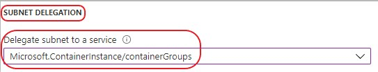
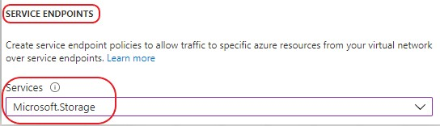

# How to use a VNet

If you have a VNET connected to your company network and you need
to be able to deploy your tests within that VNET, this document will tell
you how to configure your VNET and RAFT deployment.

RAFT assumes that all your test jobs will either be deployed in the VNET or not
in the VNET. It is a system level configuration, not a job-by-job configuration.

Note that deploying into a VNET does take a little longer than deploying outside
a VNET.

#### Step 1: Understanding the limitations

RAFT uses Azure Container Instances and they require a specific configuration of your
VNET with specific limitations. See those limitations [here](https://docs.microsoft.com/en-us/azure/container-instances/container-instances-virtual-network-concepts).

When you deploy your RAFT job, it must be deployed into the same region as your VNET.
This can be accomplished in two different ways.

One way is on a per-job basis. Using
this way, you will use the `--region` parameter whenever you submit your job to specify
your VNET region.

The second way is to deploy your RAFT service into the same region as your VNET. Using this
method you will not need to use the `--region` parameter as RAFT will default the job's
region to the system's deployment region. For example if you deploy RAFT to `westus` all
jobs will also be deployed to `westus` by default.

#### Step 2: VNET Configuration

Your VNET can exist in any region and in any resource group.

**Create a Subnet on your VNET.** When RAFT creates a Container Instance for your job and it is deployed into your VNET and subnet,
it will be assigned an
IP address from the subnet address range. Be sure to create a subnet with enough address space to hold
as many simultaneous jobs as you think you will need. For most deployments 8 bits of
address space is more than enough.

The subnet can be created via the Azure Portal.

It is important that the subnet be created only for use with Azure Container Instances. 
You do this by specifing the Subnet Delegation.
For more information on why, see the limitations referenced above.

Additionally you must enable the storage service endpoint. RAFT mounts fileshares from
your deployment's storage account onto the running containers. Setting the service endpoint
in the subnet enables this behavior.

#### Step 3: Tell RAFT about your VNET

After your VNET is configured and RAFT is deployed, use the following CLI command 
to configure RAFT to use your VNET.

`python raft.py service config-vnet --vnetName myVnet --vnetSubnetName myVnetSubnet --vnetResourceGroup myVnetRG --vnetRegion myVnetRegion`

| Parameter | Definition |
|--- | :--|
| `--vnetName` | The name of your VNET resource in Azure. |
| `--vnetSubnetName` | The name of the subnet within the VNET. |
| `--vnetResourceGroup` | The name of the resource group where the VNET lives. |
| `--vnetRegion` | The region the VNET is deployed. |

This command creates a Network Profile that is used when deploying the Container Instance
and updates the orchestrator's configuration settings `RAFT_NETWORK_PROFILE_NAME` and
`RAFT_VNET_RESOURCE_GROUP`. These orchestrator settings inform
the orchestrator how to deploy your job into your VNET.

Your VNET will need to have already been configured for this command to succeed. 

If you decide to remove the VNET configuration from RAFT use the command:
`python raft.py service clear-vnet --vnetResourceGroup myVnetRG`

