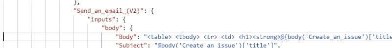

# Consuming webhooks with a logic app

This tutorial demonstrates how you can consume webhooks generated by RAFT to
create github issues and send e-mail by using a [Logic App.](https://docs.microsoft.com/en-us/azure/logic-apps)

[Hundreds of connectors](https://docs.microsoft.com/en-us/azure/connectors/apis-list)
 are available for use in your logic app. In this tutorial, we are only demonstrating the
use of two.


## Step One: Use the Azure Portal to create a Logic App

If you're unsure how to create a blank logic app, 
see this [Quickstart guide.](https://docs.microsoft.com/en-us/azure/logic-apps/quickstart-create-first-logic-app-workflow) 

Open the logic app designer view, in the following steps we will add connectors and 
code.

## Step Two: Add Http Hander

Search for **http**.


Click on **Request**, then select **When a HTTP request is received** trigger.


Then click on the **Use sample payload to generate schema** link.


We will use the JSON snippet below to create the schema. You can use any valid JSON for this purpose.
The JSON we provide here, is an example of the BugFound body generated from RAFT's BugFound webhook. 

```json
[
  {
    "Id":"37d90124-02f0-48f9-b3f7-a9c7295c04a5",
    "EventType":"BugFound",
    "Subject":"BugFound",
    "Data":{
      "Tool":"RESTler",
      "JobId":"3191249c-5a57-4f6c-9ef8-876574de6e2d",
      "AgentName":"0-RESTler-123",
      "Metadata":{
        "branch":"wizbangFeature"
      },
      "BugDetails":{
        "bugBucket":"main500_1.txt",
        "experiment":"experiment_123",
        "jobId":"3191249c-5a57-4f6c-9ef8-876574de6e2d",
        "outputFolder":"my_test_results"
      }
    },
    "DataVersion":"1.0",
    "metadataVersion":"1",
    "EventTime":"2020-11-04T18:35:54.3784505Z",
    "Topic":"event grid topic"
  }
]
```

Paste the JSON into the schema window and click **Done.**
When you click **Save**, the HTTP POST URL will be generated. 
You will use this URL when you register a Webhook with RAFT as the `--url` parameter.


## Step Three: Create a webhook

Using the RAFT CLI run the following command to create a webhook for the BugFound event.
Use the Url from the previous step as the `--url` parameter in the command.

```
python raft.py webhook create --name MyWebhook --event BugFound --url "https://prod-19.westus2.logic.azure.com:443/workflows/01697c5f..." 
```

Now you can execute the following command to send webhook test data to your logic app:

```
python raft.py webhook test --event BugFound --name MyWebhook
```

This will show up in Runs history. You may need to refresh the window for the data to appear.


When you run a job that can generate bugs (for example RESTLer Test or Fuzz),
use **MyWebhook** as the webhook name in your job configuration.

```json
    "webhook": {
        "name": "MyWebhook",
        "metadata": {}
    }
```

## Step Four: Creating a Github issue

Click **Edit** to go back to Logic App designer


Click on the **New Step** button


Search for GitHub and under the **Actions** tab, select **Create an issue**


Populate the fields for **Repository Owner** and **Repository Name**.
Add a dynamic content value to your issue. For example, we have added **Subject** to the title.
When you do this the Logic App will wrap the **Issue** with **For each**, which makes it easy to
iterate over the array data in the schema.


Then click **Code view** button to see the auto-generated code. We will be modifying this code
with the samples below.

 - Find the **body** object
 - Replace the **title** key and value using the content below
```
"title": "Found by RAFT with @{items('For_each')?['Data']?['Tool']}"
```

 - Add a **body** key and value using the content below.
```
"body" : "**Job ID**: @{items('For_each')?['Data']?['BugDetails']?['JobId']}\n@{if(equals(toLower(items('For_each')?['Data']?['Tool']), 'restler'),     concat('**RESTler job definition replay tool-coinfiguration**\n','Mount results file share that contains RESTler bug data:\n','```json\n','\"readOnlyFileShareMounts\": [\n','    {\n','      \"FileShareName\":\"',items('For_each')?['Data']?['BugDetails']?['jobId'],'\",\n','      \"MountPath\": \"/job-run\"\n','    }\n','  ]\n','```\n','Task tool-configuration (used in tasks array)\n','```json\n','\"toolConfiguration\": {\n','    \"task\": \"Replay\",\n','    \"runConfiguration\": {\n','        \"inputFolderPath\":\"','/job-run/',items('For_each')?['Data']?['BugDetails']?['outputFolder'],'/RestlerResults/',items('For_each')?['Data']?['BugDetails']?['experiment'],'/bug_buckets\"\n','    },\n','    \"replayConfiguration\": {\n','        \"bugBuckets\": [\"', items('For_each')?['Data']?['BugDetails']?['bugBucket'],'\"]\n','    }\n','}\n','```\n'    ),     ''  )}"
```

You end up with the code for the Create_an_issue step that looks like this:


Save your logic app and re-run this command to test the webhook. This will create a new issue
in your github repo.

```
python raft.py webhook test --event BugFound --name MyWebhook
```

Now look at the issues in your github repo, you should see the following.


## Step Five: Sending email with a link to the issue
Next let's add a connector to send e-mail using Outlook. We will create
email body content that contains a link to the newly opened issue in github:

In the Logic App Designer click the **Add An Action** button.


Search for **Outlook.com** or **Office 365 Outlook** and create the **Send an e-mail(V2)** Action


After you add the action, fill in the **To**, **Subject**, and **Body** fields. The **Body** we will
replace with the code below when we edit the item in the **Code view**.
Notice we used the dynamic field **Title** for the Subject field. This is the github issue title.


Click on **Code view** and find the section "Send_an_email_(V2)". Replace the "Body" with the code below.

```json
"Body" : "<table><tbody><tr><td><h1><strong>@{body('Create_an_issue')['title']} #@{body('Create_an_issue')['number']}</strong></h1></td></tr><tr><td><p><span style=\"font-size: 11px\">Created:&nbsp;@{body('Create_an_issue')?['created_at']}</span></p><p><strong>Link</strong>:&nbsp;<a href=\"@{body('Create_an_issue')?['html_url']}\">@{body('Create_an_issue')?['html_url']}</a></p></td></tr></tbody></table> ",
```

Your code should look like this:



Save your changes and re-run the webhook test. A new issue will be opened in github and you will receive
an e-mail with a link to the new github issue.

 