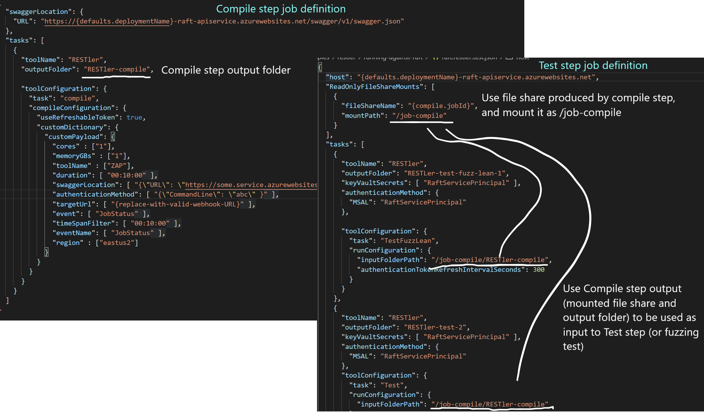

## REST API fuzz testing service and RESTler

The RAFT team owns and maintains the RESTler agent that runs on RAFT platform.
In order to provide a consistent platform for supporting multiple test tools there are some differences between how RESTler is configured when running using RAFT versus when running RESTler directly.

RAFT exposes almost all of the same configuration values that RESTler exposes. Some less frequently
used values are not currently exposed but can easily be added if needed. 
RESTler uses a mix of camel case and underscore parameters that it accepts as part of it's run configurations. 
RAFT by contrast only uses camel case parameters. As an example RESTler uses the parameter `restler_custom_payload` 
where as the same parameter is called `restlerCustomPayload` in a RAFT job definition. 

You can find the RESTler documentation [here](https://github.com/microsoft/restler-fuzzer/tree/main/docs/user-guide).

When using RESTler documentation for configuring RESTler tasks use the RAFT swagger definition for parameter name conversion.
The RAFT swagger definition can be found using this URL : *https://\<my-deployment\>-raft-apiservice.azurewebsites.net/swagger/index.html*


There are a few convenience things that RAFT will do for you. RAFT will do a DNS lookup on the 
host parameter specified in the job definition file and fill in the IP parameter for you. 
RAFT also defaults the port number 
to 443 when using SSL and 80 when not using a secure connection. If for some reason you 
find that you still need to specify the IP and port number, you can manually provide the values 
you need in the `TargetEndpoint` configuration. These values will override any lookup or default values.

## RESTler mode of operation

RAFT exposes several modes that can be used with RESTler.
- Compile</br>
  This mode is used to convert the OpenAPI (or swagger) spec into a RESTler grammar. You must run `compile` before any of the 
  other modes can be used as they will use the grammar produced.
- Test</br>
  Using this mode will cause RESTler to exercise each API once. Using this mode you can quickly determine if RESTler is able
  to call all your APIs without errors, this is reported as spec coverage. 
  See [How to Improve coverage](https://github.com/microsoft/restler-fuzzer/blob/main/docs/user-guide/ImprovingCoverage.md). 
- TestAllCombinations</br>
  By default, test mode will try to execute each request successfully once. This means that, if there are 5 possible values 
  for a parameter, and the request is successfully executed when passing the first value, the remaining 4 will not be tested.
  In some cases, such as for differential regression testing, it is desired to test all of the specified parameter values in 
  Test mode. Use the TestAllCombinations mode try all parameter values (up to maxCombinations). 
  The results for all parameter combinations will be reported in the spec coverage file.
- TestFuzzLean</br>
  In this mode, RESTler executes every endpoint+method once in the compiled RESTler grammar with a default set of checkers to see 
  if bugs can be found quickly.
- Fuzz</br>
  In Fuzz mode, RESTler will fuzz the service under test during a longer period of time with the goal of finding more bugs and 
  issues (resource leaks, perf degradation, backend corruptions, etc.). Warning: The Fuzz mode is the more aggressive and 
  may create outages in the service under test if the service is poorly implemented.
- Replay</br>
  Used to replay a bug found on a previous run.
- FuzzRandomWalk</br>
  This mode uses a random walk to traverse the graph of requests.
- FuzzBfsCheap</br>
  Using a breadth first search mode similar to what is used in the `Fuzz` mode to traverse the graph of requests 
  but does it in a "cheap" way. 

RESTler needs to compile the Swagger specifications into RESTler grammar as a first step. 
The output of the compile step is then consumed by any of the following steps: 
Test, TestAllCombinations, TestFuzzLean, Fuzz, Replay, FuzzRandomWalk, FuzzBfsCheap.

There are several ways to connect the RESTler compile task output to the other tasks.
One way is to pass the compile output data via a file share in the storage account.
This is useful when your compile step takes a long time and you don't want to run the compile task every time.

For example, a compile job produces a job ID and by default a file share is created and named using the job ID.
This makes it possible for you to take the output written to that file share and mount it to use as input to another job.
The diagram below illustrates this behavior in the job definition files.



If your compile step executes quickly, it can be much easier to simply in-line the 
tasks like this in your job definition file:</br>
```json
"tasks": [
    {
    "targetConfiguration" : {
        "endpoint" : "https://petstore3.swagger.io",
        "apiSpecifications": [
        "https://petstore3.swagger.io/api/v3/openapi.json"
        ]
    },
    "toolName": "RESTler",
    "outputFolder": "restler-pestorev3",
    "toolConfiguration": {
        "tasks": [
            {"task": "Compile"}, 
                
            {"task" : "Test"}, 
                
            {
                "task" : "Fuzz",
                "runConfiguration" : {
                    "Duration" : "00:10:00"
                }
            }
        ]
    }
  }
]
```