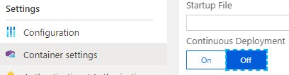

# RAFT updates and releases

Two different kinds of artifacts are released when a release is made:

- Container images that are available via public docker hub
- A python CLI which can be downloaded from the project's [github](https://github.com/microsoft/restapifuzztesting/releases) releases page. 

When the service is deployed, the service components are configured to run from the public container images. You can see this configuration on the “Container settings” tab for the orchestrator and apiservice azure resources.

Container images are released using semantic versioning:

- Major numbers are incremented when a breaking change is introduced
- Minor numbers are incremented when a new CLI is released
- Patch numbers are incremented when new features are added or a bug fix is released

The image tags produced for the containers will follow this pattern.

- v1.0.0	Initial release of a major version
- v1.0.1	Bug fixes and/or feature addition
- v1.0.2	Bug fixes and/or feature addition
- v1.1.0	Bug fix and/or feature addition (this release includes a release of the CLI)
- v1.latest	Points to the most current version of v1

Releases will be created on the github project whenever a new CLI is needed and
when a new image is release. For the releases that only include image updates,
only a description of the release will be included. To take advantage of these
releases restart the service with the python raft.py service restart command. 

Updating the service via a restart command is possible because the orchestrator
and apiservice container settings are configured to use the v1.latest image tag.
This configuration is set by default when you deploy the service with the CLI
(mcr.microsoft.com/restapifuzztesting/apiservice:v1.latest). 

If you do not want the latest bugfixes and features, you can defeat this behavior by
pinning to a specific version - "mcr.microsft.com/restapifuzztesting:v1.0.1" for example, or by
turning off the "Continuous Deployment" setting on the apiservice and/or orchestrator. 

Using the portal navigate to the apiservice and/or orchestrator. Select the "Container settings" tab
and turn off continuous deployment. Be sure to save your changes. 
 

