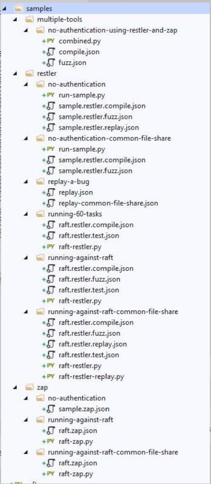

# RAFT Sample Configurations

We have included a number of sample job definition files for each of
the tools we include with REST API Fuzz Testing (RAFT), ZAP and RESTler,
along with a set of sample Python config files for RESTler.

We hope that you take advantage of them to evaluate RAFT's operation,
or as templates for automating ZAP and RESTler, or any additional tools
you might want to [onboard](how-to-onboard-a-tool.md).

The samples are located in the **cli/samples** folder under the root of
the RAFT repo, and are organized into three folders:  **Zap**, **RESTler**,
and **multiple-tools**, the latter of which shows how to execute more than
one tool in a single job.

 

## ZAP

We've provided three samples of executing [ZAP](https://www.zaproxy.org/),
a web scanner from the [OWASP Foundation](https://owasp.org/), against a target.

#### no-authentication

In this sample, the job description JSON will cause RAFT to execute 

#### running-against-raft

In this sample, the job description JSON will cause RAFT to execute ZAP against the
RAFT service itself.

#### running-against-raft-common-file-share

In this sample, the job description JSON will cause RAFT to execute ZAP against the
RAFT service itself, with a common file share TODO.

 

## RESTler

This section contains a variety of different ways to execute
[RESTler](https://github.com/microsoft/restler-fuzzer), a stateful REST API fuzzer
from [NSV at Microsoft Research](https://www.microsoft.com/en-us/research/group/new-security-ventures/),
against a target.  RESTler is more complex than ZAP; instead of a single job
definition JSON like in ZAP, there are three in RESTler, one for each of its phases.
There's also the RESTler python file, which is TODO. 

#### no-authentication

In this sample, the job description JSON will cause RAFT to execute against
an anonymous REST API.

#### no-authentication-common-file-share

In this sample, the job description JSON will cause RAFT to execute against
an anonymous REST API and share a common mounted file share with a second
task. TODO

#### replay-a-bug

In this sample, the job description JSON will cause RAFT to replay a bug found
in a previous run of the tool, either to reproduce the bug and ensure it's valid, or
to verify that the bug has been fixed. 

#### running-60-tasks

In this sample, the job description JSON will cause RAFT to execute sixty instances
of RESTler against TODO.

#### running-against-raft

In this sample, the job description JSON will cause RAFT to execute RESTler against the
RAFT service itself using authentication. TODO

#### running-against-raft-common-file-share

In this sample, the job description JSON will cause RAFT to execute RESTler against the
RAFT service itself and share a common mounted file share with a second
task TODO. 

 

## Multiple Tools

We only have one example of this, but it's instructive to see how multiple
tools may be configured to run as part of a single job.

#### no-authentication-using-restler-and-zap

In this sample, the job description JSON will cause RAFT to execute both ZAP and RESTler
against a common target TODO.

