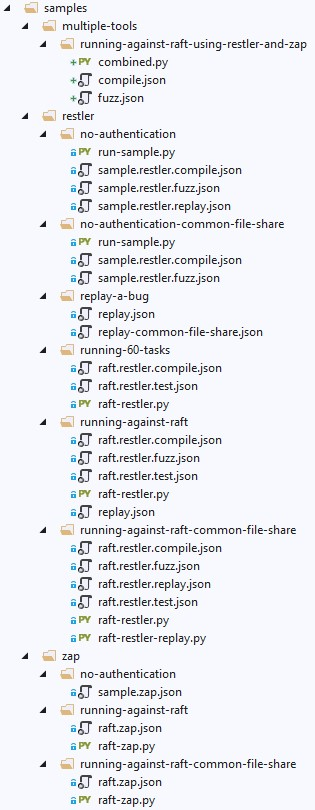

# RAFT Sample Configurations

We have included a number of sample job definitions, and python scripts
in with the CLI package.

We hope that you take advantage of them to evaluate RAFT's operation,
or as templates for automating ZAP and RESTler, or any additional tools
you might want to [onboard](how-to-onboard-a-tool.md).

The samples are located in the **cli/samples** folder under the root of
the RAFT repo, and are organized into three folders:  **Zap**, **RESTler**,
and **multiple-tools**, the latter of which shows how to execute more than
one tool in a single job.


## List of samples

<br/>

## ZAP

We've provided three samples of executing [ZAP](https://www.zaproxy.org/),
a web scanner from the [OWASP Foundation](https://owasp.org/), against a target.
We've setup the ZAP agent to use it's [API scanning ability](https://www.zaproxy.org/docs/docker/api-scan/).
The ZAP agent we have written can be found in the raft-tools/tools folder. It's written
in python so that you can see how you might write a similar agent for a different tool. 

</br>

#### no-authentication

The no-authentication sample is one of the most simple. It assumes a target that requires
no authentication. The job definition defines a single tool to run against the target. 

Note the use of values in curly braces, these are values that would need to be replaced by real host
values. Either edit the file or use the `--substitute` parameter on the CLI to substitute the 
`{sample.host}` string with an actual value.

</br>

#### running-against-raft

In this sample, the job description JSON will cause RAFT to execute ZAP against the
RAFT service itself. This assumes that you've already deployed the RAFT service. 

Note that when you
deployed the service, a secret, with correct values, called **RaftServicePrincipal** was
created for you.

The raft-zap.py script gives an example of how you can substitute your deployment name using the CLI
so that the job definition can stay generic. 

From the CLI directory run the sample with the command:
```python
python samples/zap/running-against-raft/raft-zap.py
```

or, using the CLI use (assuming a deployment name of `demo`):
```json
python raft.py job create --file samples/zap/running-against-raft/raft.zap.json --substitute "{\"{defa
ults.deploymentName}\" : \"demo\"}"
```

</br>

#### running-against-raft-common-file-share

In this sample, the job description JSON will cause RAFT to execute ZAP against the
RAFT service itself, defining a common file share called **raft**. This can be helpful
when you want to collect results from multiple job runs under a single file share. 

<br/>

## RESTler

This section contains a variety of different ways to execute
[RESTler](https://github.com/microsoft/restler-fuzzer), a stateful REST API fuzzer
from [NSV at Microsoft Research](https://www.microsoft.com/en-us/research/group/new-security-ventures/),
against a target.  RESTler is more complex than ZAP; instead of being able to use a single job
definition as we do for ZAP jobs, there are multiple job definitions for RESTler, one for each of its phases.
Not all phases are required, some optional phases are included for illustration purposes. 

There's also the RESTler python script, which shows how you can connect the phases of a RESTler job
into a workflow, the output of one phase becoming the input of another, illustrating how you can run
the whole workflow in one script. 

#### no-authentication

In this sample, the job description JSON will cause RAFT to execute against
an unauthenticated REST API.

RESTler requires a compile step before running a Test or Fuzz step. In the **sample.restler.compile.json** file
notice the **namePrefix** field, this prefix will be prepended to the job id which can make it easier to find
the job id on the resulting file share. 

There is also a **webhook** section which defines a name and an empty dictionary for metadata. The metadata 
can be used to take information from your build pipeline and deliver it when a webhook is fired. 

Also notice the **toolConfiguration** section. This section defines tool specific information. Here the information
tells RESTler to perform the `Compile` task. 

In the **sample.restler.fuzz.json** file notice that there are two tasks defined. These tasks run in parallel. The fuzz
task has a duration defined which means the task will run no longer than this duration. The `test-fuzz-lean` task, 
or any RESTler `test` task, should not define a duration.


#### no-authentication-common-file-share

This sample is much the same as the no-authentication sample, the main difference being the use
of the  **rootFileshare** field. Because this is defined, look for the folder with the job id under this
file share.

The **rootFileshare** is a great way to organize related jobs together. 

#### replay-a-bug

In this sample, the job description JSON will cause RAFT to replay a bug found
in a previous run of the tool, either to reproduce the bug and ensure it's valid, or
to verify that the bug has been fixed.

During development you will want to be sure that the developed fix actually fixes the reported issue.
Replaying the original bug is a way to test the fix without needing to run the fuzz task all over again.

In **replay-common-file-share.json** there are two tasks defined. The first task shows you how to replay a specific
bug by defining the `{bugBucket}` value. 

The second task, will replay all the bugs found from when fuzzing. 

The only different between the two example files is the use of the common file share defined in **rootFileshare**.

#### running-60-tasks

In this sample, the job description JSON will cause RAFT to execute sixty instances
of RESTler against raft.

This example shows how you can create multiple containers within one container group. Each container group
allows for up to 60 containers to run. In this sample the python script spawns pairs of `test` and `testfuzzlean` tasks.

This sample shows you how simple it is to create multiple tasks configured on the fly.

#### running-against-raft

In this sample, the job description JSON will cause RAFT to execute RESTler against the
RAFT service itself using authentication. 

You will notice in the **raft.restler.compile.json** job definition values in the `customerPayload` dictionary. This
dictionary is given to RESTler and it's values are used as fuzzing values in the REST calls.

#### running-against-raft-common-file-share

In this sample, the job description JSON will cause RAFT to execute RESTler against the
RAFT service itself and share a common mounted file share.

This example demonstrates how to run various jobs and collect the results under a common file share.  

<br/>

## Multiple Tools

We only have one example of this, but it's instructive to see how multiple
tools may be configured to run as part of a single job.

#### running-against-raft-using-restler-and-zap

In this sample, the job description JSON will cause RAFT to execute both ZAP and RESTler
against the RAFT service itself.
