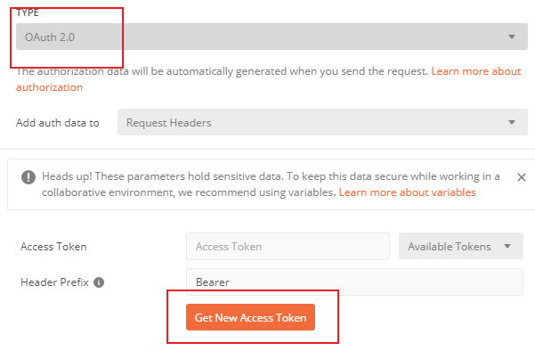
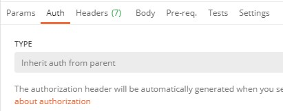

# Using postman with the API

Using postman to send requests to the API is straight forward. Create a collection, establish the scripts for authentication, and send requests.

## Authentication

The APIService webapp expects a bearer token on each api request. 

Postman can handle the creation of bearer tokens. See https://learning.postman.com/docs/postman/sending-api-requests/authorization/ for more details.

### Edit App Registration in Azure Portal
In order to enable creation and use of the bearer token in postman you will need to update the app registration in Azure AD to add a URI callback.

Using the azure portal, edit your app registration.
  Add the value `https://www.getpostman.com/oauth2/callback` as a Redirect URI.
 

### Manual Token Generation in Postman

* Use the Auth tab on the request (or on the collection).
* Select `OAuth 2.0` and click on the `Get New Access Token` button.<br>


* Add the  Callback URL `https://www.getpostman.com/oauth2/callback`
* The `Auth URL` should be `https://login.microsoftonline.com/microsoft.onmicrosoft.com/oauth2/authorize?resource=00000000-1234-1234-0000-000000000000` 
The guid assigned to the resource is the client id of the app registration
* Enter the Client ID in the Client ID field. 


## Auto Token Generation
It is possible to have Postman created the token automatically as needed before sending the request.
The idea is that you have the pre-request script run and generate the token. The script sets the token to 
an environment variable which then is used by the request.

Edit your collection of requests and set the 'Pre-request Scripts' to
```
const echoPostRequest = {
  url: 'https://login.microsoftonline.com/<your AAD TenantID>/oauth2/token',
  method: 'POST',
  header: 'Content-Type:application/x-www-form-urlencoded',
  body: {
            mode: 'urlencoded',
            urlencoded: [
                    { key: "client_id", value: "your client id here" },
                    { key: "client_secret", value: "your secret here" },
                    { key: "resource", value: "your client id here" },
                    { key: "grant_type", value: "client_credentials" },
            ]
    }
};

var getToken = true;

if (!pm.environment.get('accessTokenExpiry') || 
    !pm.environment.get('currentAccessToken')) {
    console.log('Token or expiry date are missing')
} else if (pm.environment.get('accessTokenExpiry') <= (new Date()).getTime()) {
    console.log('Token is expired')
} else {
    getToken = false;
    console.log('Token and expiry date are all good');
}

if (getToken === true) {
    console.log('getToken is true')
    pm.sendRequest(echoPostRequest, function (err, res) {
    console.log(err ? err : res.json());
        if (err === null) {
            console.log('Saving the token and expiry date')
            var responseJson = res.json();
            pm.environment.set('currentAccessToken', responseJson.access_token)
    
            var expiryDate = new Date();
            expiryDate.setSeconds(expiryDate.getSeconds() + responseJson.expires_in);
            pm.environment.set('accessTokenExpiry', expiryDate.getTime());
        } else {
            console.log('Error')
        }
    });
}
```

* Add two environment variables. accessTokenExpiry and currentAccessToken.
* Under the Authorization tab, select the authorization type `Bearer Token` and set the token to `{{currentAccessToken}}`
* For every request in your collection, set the Auth value to `Inherit auth from parent`



Now this script will run and get a token before every request as needed. 