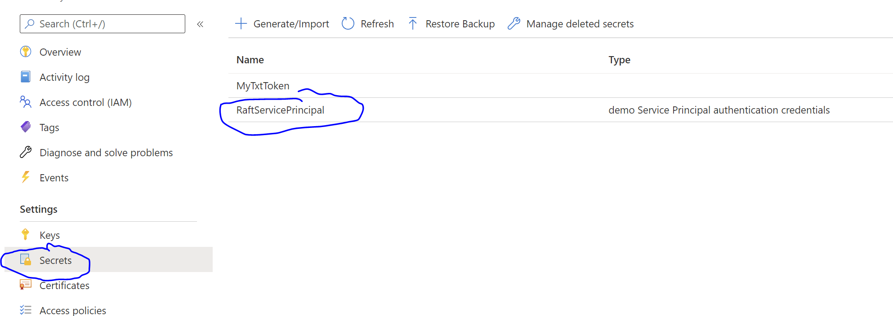
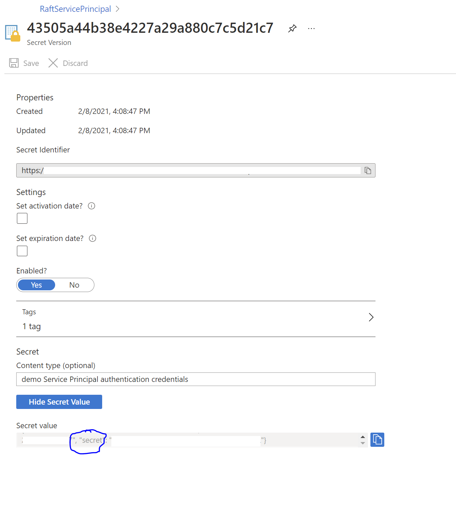
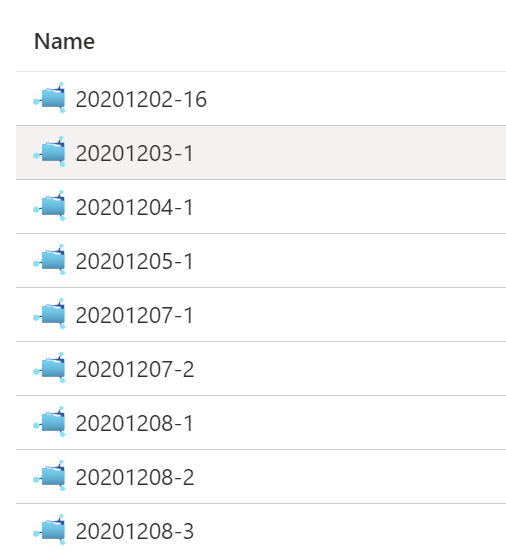

# How to use RAFT with Azure Dev-Ops

- Create Azure Dev-Ops variable group
- Push RAFT CLI with defaults.json and RAFT job definition configs into a source control
- Create and run new Azure Dev-Ops pipeline

Azure Dev-Ops YAML definition:

```yaml
trigger:
  batch : true
  branches:
    include:
      - '*'

variables:
  - group: raft-cicd

stages:
  - stage: Test
    jobs:
      - job: BuildVerification
        pool:
          vmImage: 'ubuntu-latest'
        steps:
          - task: UsePythonVersion@0
            inputs:
              versionSpec: '3.8' 
              addToPath: true

          - script: pip3 install -r requirements.txt
            displayName: Install CLI Python requirements

          - task: AzureCLI@2
            displayName: "Run RAFT"
            inputs:
              azureSubscription: $(subscription)
              scriptType: 'pscore'
              scriptLocation: 'inlineScript'
              inlineScript: "$build = \"$(Build.BuildNumber)\".Replace(\".\", \"-\"); $substitute =\"`\"{`\\`\"{ci-run}`\\`\":`\\`\"$build`\\`\"}`\"\"; python raft.py --secret $(secret) job create --substitute \"$substitute\" --file raft-configs/run.json --poll 10"
```

`raft-configs/run.json` - is a location of your RAFT job configuration file in this example.

`$substitute` - is a JSON key-value dictionary that will be used to replace matching keys in your job definition file. The escape character sequence when defining `$substitute` is a messy one. This can be simplified you write a python script that calls RAFT SDK to run the jobs. See [RAFT petstore3 sample](../../cli/samples/restler/self-contained/swagger-petstore3/run.py).

`raft-cicd` variable group defines and sets following variables: `$(subscription)` - this is Azure Subscription ID where RAFT is deployed.
`$(secret)` is a "secret" field from RaftServicePrincipal located in RAFT Azure Keyvault as shown in screenshots below.





In your job configuration file you must define `RootFileShare` with value `{ci-run}`, which will be replaced with Azure Dev-Ops build ID

```json
{
  "rootFileShare": "{ci-run}",
  "testTasks": {
    "targetConfiguration" : {
      "apiSpecifications": [
          ...
      ]
    },
    "tasks": [
        ...
    ]
  }
}
```

RAFT results Azure storage will have file shares matching build IDs as follows:


Where each file share contains all logs produced by the Azure Devops run.