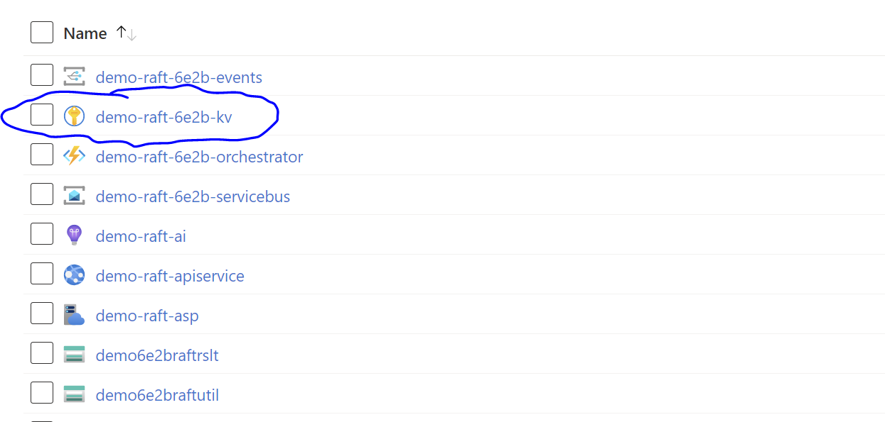

# How to use Token authentication

- Add token to RAFT keyvault 
- Specify in job config token authentication

**Add token to RAFT keyvault**

Got to your RAFT deployment keyvault

Under the `Secrets` select `Generate/Import` button.

Create a secret with name that follows environment variable conventions (e.g. no dashes in the name). Add you `Token` text as the secret value.

**Specify in job config token authentication**

In your job config specify the secret to be imported in the list of `keyVaultSecrets`. Use that secret as `TxtToken` authentication method.

