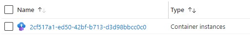
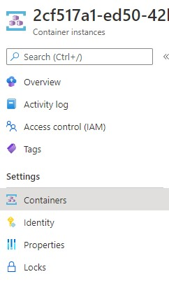
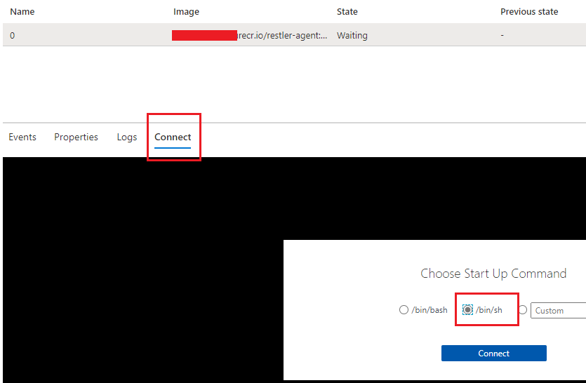
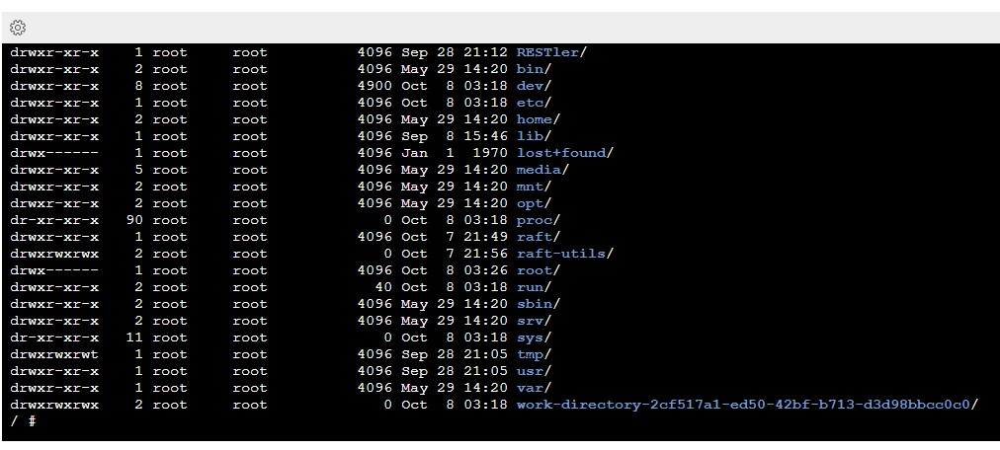

# How to SSH to a container

When you need to look at see what is happening on a container to look at logs,
or to try out commands, see environment variables, etc use SSH or the shell availble 
on the container through the portal.

When adding a tool to use in the system, or using an existing tool, you can find
the commands used to run the tool in the `cli/raft-tools/tools` folder. Each
tool has a `config.json` file that defines the command to run when launching
a job and also a command to run when the tool configuration value `isIdle` is set to `true`.

For example, the following would start /bin/sh and wait.

```
	"idle" : {
		"command" : "/bin/sh",
		"arguments" : ["-c", "echo DebugMode; while true; do sleep 100000; done;"]
	}
```

Using the [azure portal](https://azure.portal.com) navigate to the resource group where
the service is deployed. Once a job is created you will be able to see the container
instance in the resource group. The name of the resource is the same as the job id.

For example:</br>
</br>
Here the value `2cf517a1-ed50-42bf-b713-d3d98bbcc0c0` is the job id.

Click on the container and select the "Containers" tab. 



Click on the connect tab and the shell you want to invoke on the container. In this example
/bin/sh is selected.



Once connected use the /bin/sh commands to navigate the system.



Note that once a container is launched in `isIdle` mode, the container instance
will need to be deleted either with the CLI delete command, or through the portal. The
service will not automatically garbage collect these containers.